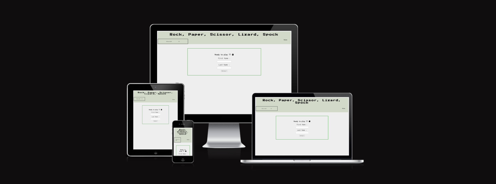
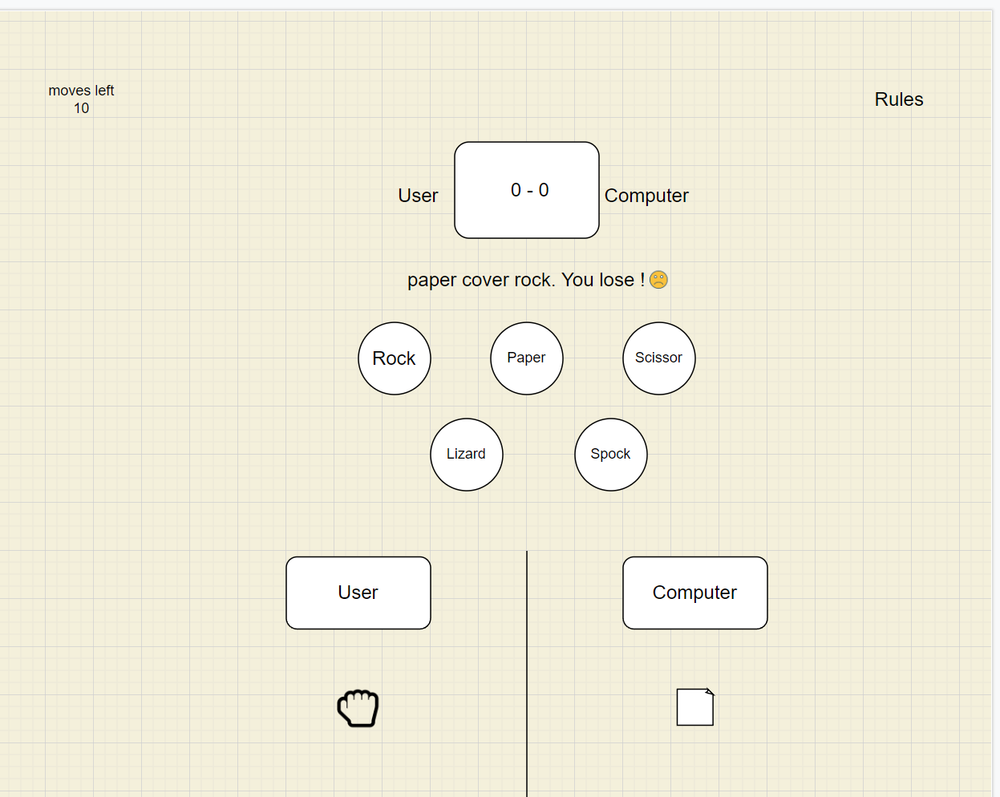
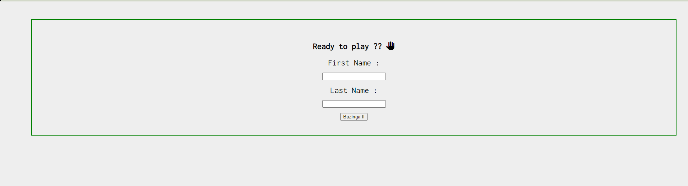
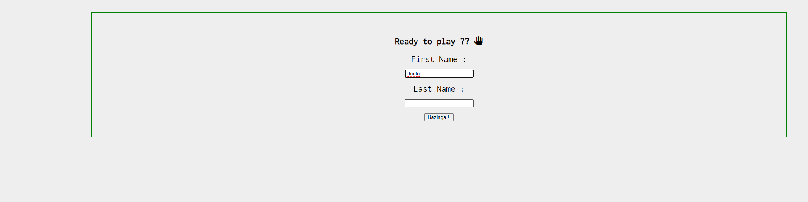
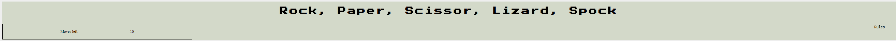
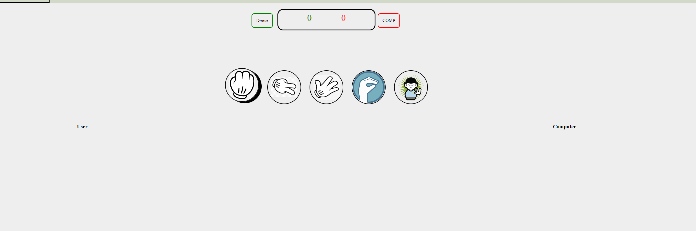
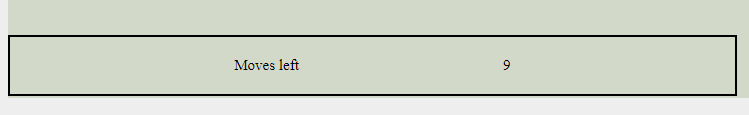
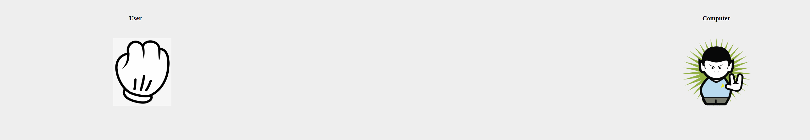
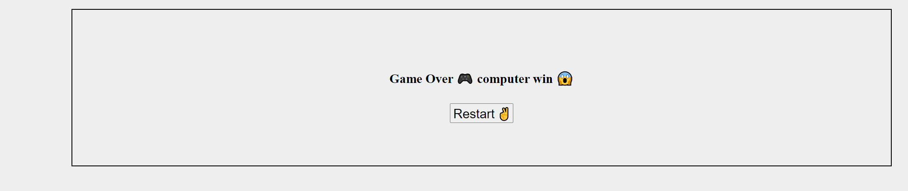
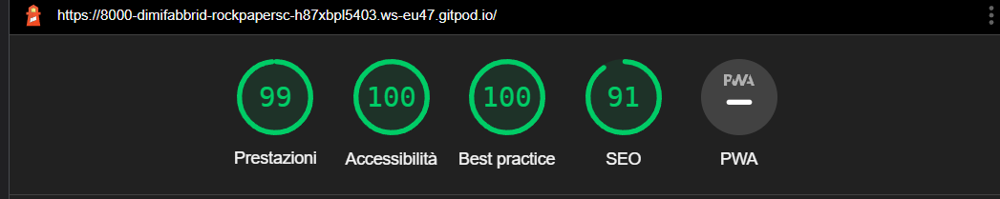

# Rock, Paper, Scissor, Lizard, Spock

This second project's web page is a funny game with some references to The Big Bang Theory from where I discovered for the first time this implementation of the traditional game. 

In this site I wanted to show how to apply the logic rules behind rock,paper,scissor game using javascript giving to the user the possibility to plsy as many game they want having an opponent always ready, the computer, using a random choice funvtion, so unpredicable that make the game funnier.

 </img>

# Wireframe

 </img>

## User Experience (UX)

-   ### User stories

    -   #### First Time Visitor Goals

        1. As a First Time Visitor, I want to find a simple interface to undestand leaving me just the worry to play and have fun
        2. As a First Time Visitor, I want a personalized experience with the possibility of put my name as user label
        3. As a First Time Visitor, I want understand with every moves how the game is going on.

    -   #### Returning Visitor Goals

        1. As a Returning Visitor, I want have the possibility to pass my spare time in a funny way with a challenging quick game. 
    

    -   #### Frequent User Goals
        1. As a Frequent User, I want to have every game an unexpected result thanks to the randomicity of the choice take from my opponent, keeping the focus always high, a costant challenge and a never repetitive game.
    

# Features

# Existing features

## Pregame

The first feature that the user see is the pregame form wher the user can put his name before start the actual game to give the chance to have a personalized experience. I wanted add a funny reference to The Big Bang Theory with a word that Sheldon says several time during the tv serie.

  

## Banner

The second feature is the banner where the user find the title, that is also the name of the game, then on the bottom left the moves counter that give to the user a way to realize how many moves remaines before the game is over and the winner is decided.
On the bottom right instead is shown the rules text where, if the user hover on it, is displayed the rules of the implemented game to give a further understanding to how play this kind of mode for the first time.  

 

## Game set

The third feature is the game set where on the top the user can find his/her name beside the scoreboard with a label with a color that match the points displayed.
in the middle of the page we can find the possible choices for the user all responsive with a hover effect giving a more immersive sensation.
On the bottom 2 hide box are placed where, after the choice is made, the user can compare his/her with the one took from the computer and have a complete undestanding round by round what is going on during the match. 

## Moves

The fourth feature is the display of the moves made from the players with a little description of the action that declare the winning of the losing of each choice with a clear description of how win this round.
We can see the points updated for each round as descripted.
As we can see also the moves remained they are updated every rounds. 
The last feature of this section is the timer that beats the time of the game and the moves with a countdown, from the moment the buttons are disabled. 

## Choice display

The fifth feature is the section with the hide boxes where the user and computer choice are displayed giving to the user an additional way to realize the opposed choice made and have a clear understanding of the rules after a couple of gasmes.

## Gameover

The last feature is the game over interface where is swown a simple game over message and the winner of the game.

To complete the game is present also a button with the user can restart the game and have a revenge if like in this case have lost or just challenge the fate and give to the computer another opportunity.

## Feature left to implement

* Leaderboard for the user to challenge each other on the max points achieve in 10 rounds
* Create a server that give the possibility of having a multiplayer game with real users

# Testing

## Validator Testing

* HTML
    * Tested the code returning 0 errors https://validator.w3.org/nu/?doc=https%3A%2F%2Fcode-institute-org.github.io%2Flove-maths%2F#textarea

* CSS
    * Tested the code returning 0 errors https://jigsaw.w3.org/css-validator/validator

* Javascript

    * Tested the code returning 0 errors 

    * There are 17 functions in this file.

    * Function with the largest signature take 1 arguments, while the median is 0.

    * Largest function has 38 statements in it, while the median is 3.

    * The most complex function has a cyclomatic complexity value of 21 while the median is 1.

## Performance 

## Testing User Stories from User Experience (UX) Section

-   #### First Time Visitor Goals
1. As a First Time Visitor, I want to find a simple interface to undestand leaving me just the worry to play and have fun

    1. The user is welcome in the site with a simple form to compile.
    2. As soon the form is compiled and the game start and the user can easily start to play and have fun

 2. As a First Time Visitor, I want a personalized experience with the possibility of put my name as user label

    1. The pregame form is use to get the first name of the user and give a more immersive experience.

 3. As a First Time Visitor, I want understand with every moves how the game is going on.

    1. Whenever the user make a choice the interface that see explain in 3 different ways the winner and the choices made from each player, with a text message, updated score and images that pop up on the bottom of the page

-   #### Returning Visitor Goals

1. As a Returning Visitor, I want have the possibility to pass my spare time in a funny way with a challenging quick game. 

    1. As shown, on the top of the page are displyed the moves remained, and from the moment the game is set to have maximum 10 moves before is over every match became a fast entertainment.

  #### Frequent User Goals

 1. As a Frequent User, I want to have every game an unexpected result thanks to the randomicity of the choice take from my opponent, keeping the focus always high, a costant challenge and a never repetitive game.

    1. The computer 'player' is built to have a random choice every round giving a bit of suspence every time the user play his/her choice pushing him/her to take a moment to ponder the next move keeping the tension high not having the chance to predict the next move of the opponent.

 # Deployment

  * The site was deployed to GitHub pages. The steps to deploy are as follows:
* In the GitHub repository, navigate to the Settings tab
* From the source section drop-down menu, select the Master Branch
* Once the master branch has been selected, the page will be automatically refreshed with a detailed ribbon display to indicate the successful deployment.
* The live link can be found here - https://dimifabbridf96.github.io/rock-paper-scissor-lizard-spock/.

# Credit

## Content 

* Cheched on - https://codepen.io/giana/pen/BZaGyP some advise about the shadowing.
* Found an exhaustive explaination of how to show with an hover effect 1 image on - https://www.sitepoint.com/community/t/on-mouseover-display-image-first-post/35684/2  
* in-depth study about some doubts during the development of the project with the help of https://www.w3schools.com/

## Media 

* Image of rules from - https://www.nicepng.com/downpng/u2q8u2a9q8w7a9i1_game-image-rock-papers-scissors-quotes/

# Acknowledgements

* I would like to thank my mentor Jack Wachira that helps me with some very good advices about the possible features to add on the project distinguishing it from other similar ideas.

